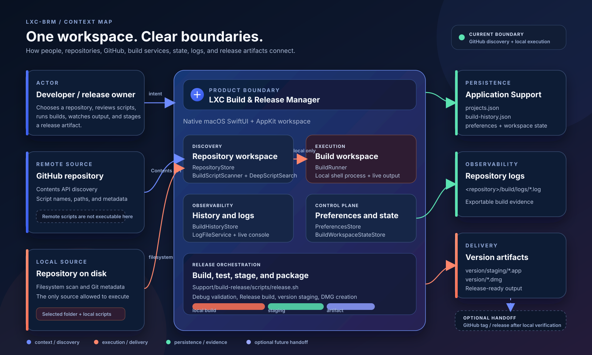
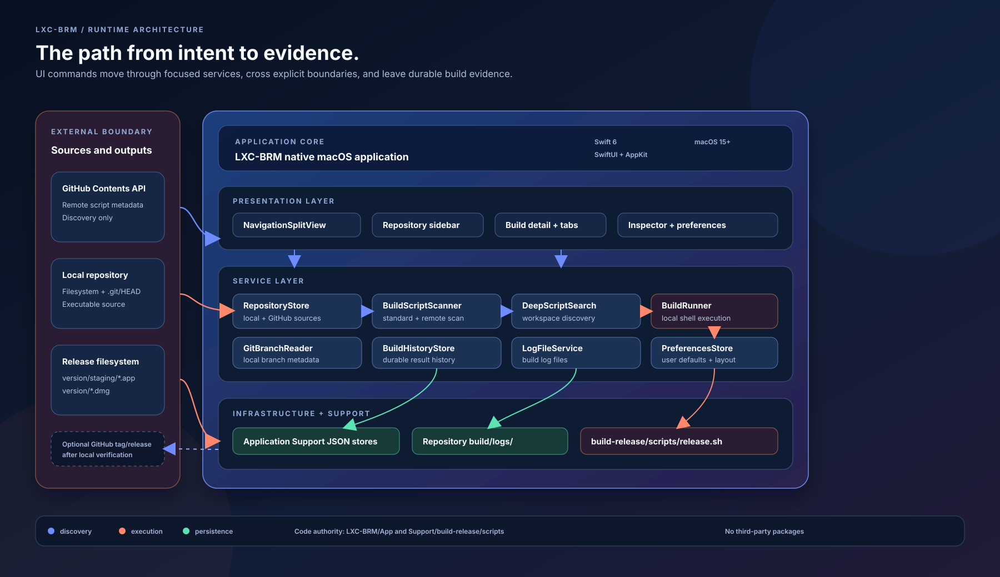

# Architecture

This document describes the current shape of both the native app and the Support workspace around it.

## Visual architecture

The canonical visual set lives in [`diagrams/`](diagrams/). These SVGs make the boundaries legible before a contributor opens the Xcode project:

The key boundary is intentional: GitHub URLs can be inspected through the Contents API, but only a local repository path is passed to the build runner. Build history and preferences persist in Application Support, repository execution logs stay under `build/logs/`, and local release artifacts are staged under `version/`.

## Product architecture

- The product is a native macOS application built with Swift 6, SwiftUI, AppKit, Foundation, and XCTest.
- The Xcode project lives under `LXC-BRM/` and targets macOS 15 or later.
- The app shell uses a `NavigationSplitView` with a repository sidebar, repository detail workspace, and optional right-side inspector.
- The detail workspace owns Build, Logs, History, Overview, and Settings surfaces for the selected repository.
- The app has no third-party package dependency; local files and Apple system frameworks are the baseline.

## Runtime responsibilities

| Responsibility | Main implementation area | Persistent result |
| --- | --- | --- |
| Repository input and recent list | `App/Services/RepositoryStore.swift` | `~/Library/Application Support/LXC-BRM/projects.json` |
| Script discovery and path safety | `App/Services/BuildScriptScanner.swift` and `DeepScriptSearch.swift` | In-memory scan result plus workspace selections |
| Build execution | `App/Services/BuildRunner.swift` | Live output and a `BuildRecord` |
| History and statistics | `App/Services/BuildHistoryStore.swift` | `~/Library/Application Support/LXC-BRM/build-history.json` |
| Logs | `App/Services/LogFileService.swift` | `<repository>/build/logs/*.log` |
| Preferences and layout | `App/Services/PreferencesStore.swift` | `~/Library/Application Support/LXC-BRM/preferences.json` |
| Build workspace selections | `App/Services/BuildWorkspaceStateStore.swift` | `~/Library/Application Support/LXC-BRM/build-workspace-state.json` |

## External and release boundaries

| Boundary | Current behavior | Evidence |
| --- | --- | --- |
| GitHub discovery | `BuildScriptScanner` can inspect a GitHub Contents API response and represent remote scripts as metadata. | `App/Services/BuildScriptScanner.swift` |
| Local execution | `BuildRunner` launches a configured local shell process; remote script metadata is not executable. | `App/Services/BuildRunner.swift` |
| Build evidence | `BuildHistoryStore` records results and `LogFileService` writes repository-local log files. | `App/Services/BuildHistoryStore.swift`, `App/Services/LogFileService.swift` |
| Release packaging | `release.sh` builds a Release app, stages the `.app`, and creates a dated DMG under `version/`. | `Support/build-release/scripts/release.sh` |
| GitHub distribution | A tag or release can be a later handoff after local verification; it is not presented as the local build executor. | Release workflow documentation |

## Workspace architecture

- `LXC-BRM/` is the Xcode-openable native app container.
- `Support/` is the non-app project handbook and delivery workspace.
- `Support/build-release/` owns scripts, release instructions, configuration examples, and version staging.
- `Support/context/` owns requirements, architecture, rules, decisions, and design references.
- `Support/context/diagrams/` owns the source-controlled visual maps of those boundaries.
- `Support/frameworks/` owns the framework and integration inventory.
- `Support/shared/` owns reusable conventions and cross-feature ideas.
- `Support/worklog/` owns the master checklist, feature plans, and dated execution narratives.

## Documentation architecture

- The repository root `README.md` is the top-level landing page.
- `LXC-BRM/README.md` is the app product guide.
- `Support/README.md` is the Support handbook and full project map.
- Each Support child README is an index for that folder, not a replacement for the master worklog.
- The master dated todo is the release-wide tracker. Detailed feature plans live beside it and link back to the master.
- Dated decision records live under `context/decisions/`.

## Decision precedence

1. Code describes the shipped runtime behavior.
2. Dated decisions describe the chosen implementation when the requirements input is ambiguous or conflicts with the product direction.
3. Requirements describe the requested behavior and historical scope.
4. Worklog files describe delivery status and verification evidence.

If these sources disagree, do not silently rewrite history. Update the decision or worklog so the difference is visible, then change the code intentionally.

Return to [`README.md`](README.md) or the [Support Handbook](../README.md).
