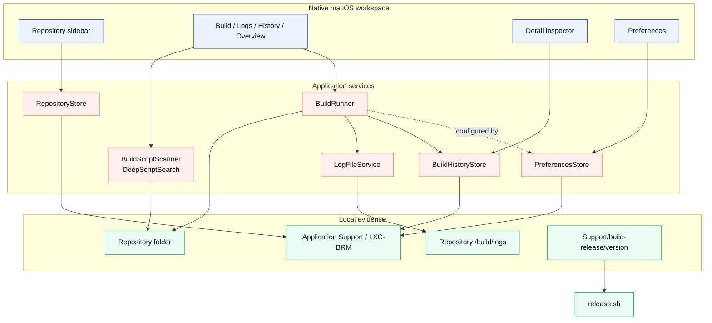
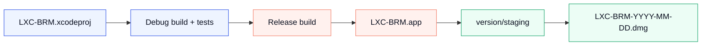

# LXC Build & Release Manager

<div align="center">
  
  <br>
  <br>
  <strong>A release room for the scripts you already trust.</strong>
  <br>
  <sub>Discover the workflow. Run it visibly. Preserve the evidence. Ship with intent.</sub>
  <br>
  <br>
  <a href="LXC-BRM/README.md">Product guide</a>
  &nbsp;&nbsp;|&nbsp;&nbsp;
  <a href="LXC-BRM/Support/README.md">Support handbook</a>
  &nbsp;&nbsp;|&nbsp;&nbsp;
  <a href="LXC-BRM/Support/build-release/USER_GUIDE.md">User guide</a>
  &nbsp;&nbsp;|&nbsp;&nbsp;
  <a href="LXC-BRM/Support/context/architecture.md">Architecture</a>
  <a href="LXC-BRM/Support/context/diagrams/README.md">Visual diagrams</a>
</div>

<br>

<div align="center">
  
  
  
  
  
  
</div>

<br>

<table align="center">
  <tr>
    <td width="33%" bgcolor="#EEF4FF"><strong>01 / DISCOVER</strong><br><sub>Turn repository structure into a clear build surface.</sub></td>
    <td width="33%" bgcolor="#FFF1EE"><strong>02 / OBSERVE</strong><br><sub>Watch every process, line, status, and outcome as it happens.</sub></td>
    <td width="33%" bgcolor="#ECFDF5"><strong>03 / RELEASE</strong><br><sub>Move from a trusted local build to a deliberate artifact.</sub></td>
  </tr>
</table>

## The premise

Every serious project has a build language of its own: a handful of shell scripts, a few release conventions, a log folder, and a lot of tribal memory. LXC-BRM turns that invisible language into a native macOS workspace without replacing the scripts or hiding the process behind a black box.

Point LXC-BRM at a repository. It finds the build contract, presents the available commands, runs local work in the right context, streams the output, records the result, and keeps the project knowledge close enough to guide the next release.

This is not another CI platform. It is the calm, inspectable room between a repository and the person responsible for shipping it.

## Product flow

```mermaid
flowchart LR
    A["Repository"] --> B["Discover scripts"]
    B --> C["Choose a build"]
    C --> D["Run locally"]
    D --> E["Live output"]
    E --> F["History + logs"]
    F --> G["Release artifact"]

    classDef source fill:#EEF4FF,stroke:#3155E7,color:#0B1020,stroke-width:1.5px;
    classDef action fill:#FFF1EE,stroke:#F27D68,color:#0B1020,stroke-width:1.5px;
    classDef evidence fill:#ECFDF5,stroke:#16A36A,color:#0B1020,stroke-width:1.5px;
    class A,B source;
    class C,D action;
    class E,F,G evidence;
```



## What ships

<table>
  <tr>
    <td width="50%"><strong>Repository intelligence</strong><br><sub>Local folders and GitHub URLs, recent repositories, pinned projects, source state, branch display, and clear missing-folder or unreachable states.</sub></td>
    <td width="50%"><strong>Script discovery</strong><br><sub>Standard discovery under <code>/build/scripts</code>, executable-file detection, readable labels, location classification, and optional deep search for scripts elsewhere in a local tree.</sub></td>
  </tr>
  <tr>
    <td><strong>Build execution</strong><br><sub>Configured shell execution from the repository root, parameter validation, environment variables, timeouts, stop behavior, and child-process handling.</sub></td>
    <td><strong>Live console</strong><br><sub>Timestamped stdout and stderr, buffered partial lines, search, filters, line numbers, word wrapping, auto-scroll, copy, and export.</sub></td>
  </tr>
  <tr>
    <td><strong>History that explains the work</strong><br><sub>Per-repository runs, success and failure states, duration, average time, success rate, last-run metadata, and retained log files.</sub></td>
    <td><strong>A release-ready workspace</strong><br><sub>Native preferences, layout controls, right-side detail inspector, release scripts, local app staging, and a dated DMG workflow.</sub></td>
  </tr>
</table>

## Runtime architecture

The app keeps the visual shell thin and gives each responsibility a clear owner. SwiftUI composes the workspace; services own discovery, execution, persistence, and release evidence.



The detailed responsibility map lives in [Support/context/architecture.md](LXC-BRM/Support/context/architecture.md). The source-controlled SVG maps live in [Support/context/diagrams](LXC-BRM/Support/context/diagrams/README.md).

## Release pipeline

The release path is intentionally boring: verify first, package second, inspect the artifact third.



Run the local packaging flow from the repository root:

```sh
./LXC-BRM/Support/build-release/scripts/release.sh
```

The generated app and DMG are intentionally ignored by Git. The staging contract is documented in [version/README.md](LXC-BRM/Support/build-release/version/README.md). Production distribution still requires Developer ID signing and notarization.

## Quick start

### Build and test from the terminal

```sh
xcodebuild -project LXC-BRM/LXC-BRM.xcodeproj -scheme LXC-BRM -configuration Debug build
xcodebuild -project LXC-BRM/LXC-BRM.xcodeproj -scheme LXC-BRM -configuration Debug test
```

### Run from Xcode

Open `LXC-BRM/LXC-BRM.xcodeproj`, choose the `LXC-BRM` scheme and `My Mac`, then press `Cmd+R`.

### Give the app a repository

The default repository contract is intentionally small:

```text
your-repository/
  build/
    scripts/
      build-ios.sh
      release.sh
    logs/
```

Add a local folder or GitHub URL from the sidebar. GitHub sources can be inspected through the contents API; only local checkouts can execute a script because the process must have a real working directory.

## Support is part of the product

The `Support/` tree is not loose project paperwork. It is the product's memory and release operating system.

```mermaid
flowchart LR
    requirements["Requirements"] --> decisions["Decisions"]
    decisions --> tracker["Master worklog"]
    tracker --> plan["Feature plan"]
    plan --> code["App code"]
    code --> verify["Build / test / GUI evidence"]
    verify --> story["Dated worklog story"]

    classDef context fill:#EEF4FF,stroke:#3155E7,color:#0B1020;
    classDef delivery fill:#FFF1EE,stroke:#F27D68,color:#0B1020;
    classDef evidence fill:#ECFDF5,stroke:#16A36A,color:#0B1020;
    class requirements,decisions context;
    class tracker,plan,code delivery;
    class verify,story evidence;
```



| Area | What it owns | Open it |
| --- | --- | --- |
| Build and release | Commands, packaging, project mapping, logs guidance, and artifact staging. | [Support/build-release](LXC-BRM/Support/build-release/README.md) |
| Context | Requirements, architecture, rules, decisions, and design references for humans and AI tools. | [Support/context](LXC-BRM/Support/context/README.md) |
| Frameworks | System framework inventory and future package or adapter records. | [Support/frameworks](LXC-BRM/Support/frameworks/README.md) |
| Shared | Reusable conventions and cross-feature ideas. | [Support/shared](LXC-BRM/Support/shared/README.md) |
| Worklog | Master checklist, feature plans, release mapping, and dated execution notes. | [Support/worklog](LXC-BRM/Support/worklog/README.md) |

## Current release signal

<table>
  <tr>
    <td bgcolor="#EEF4FF"><strong>0.1.2</strong><br><sub>current product line</sub></td>
    <td bgcolor="#EEF4FF"><strong>Native macOS</strong><br><sub>Swift 6, SwiftUI, AppKit, Foundation</sub></td>
    <td bgcolor="#FFF1EE"><strong>Tagged build</strong><br><sub><code>release-2026-08-16</code></sub></td>
    <td bgcolor="#ECFDF5"><strong>Verification</strong><br><sub>Debug build + 9 tests, 0 failures</sub></td>
  </tr>
</table>

The remaining hardening work is kept honest in the [master worklog](LXC-BRM/Support/worklog/todo-2026-08-16.md), including performance measurement, stress testing, settings verification, and wider GUI coverage.

## Data locations

| Data | Location |
| --- | --- |
| Recent repositories | `~/Library/Application Support/LXC-BRM/projects.json` |
| Build history | `~/Library/Application Support/LXC-BRM/build-history.json` |
| Build workspace state | `~/Library/Application Support/LXC-BRM/build-workspace-state.json` |
| Preferences | `~/Library/Application Support/LXC-BRM/preferences.json` |
| Runtime logs | `<repository>/build/logs/` |
| Release staging | `LXC-BRM/Support/build-release/version/` |

## Documentation navigation

| If you want to... | Read... |
| --- | --- |
| Understand the app experience | [LXC-BRM/README.md](LXC-BRM/README.md) |
| Operate the app | [User Guide](LXC-BRM/Support/build-release/USER_GUIDE.md) |
| Package a release | [Build and Release](LXC-BRM/Support/build-release/README.md) |
| Give an AI tool project context | [Support Handbook](LXC-BRM/Support/README.md) and [Context README](LXC-BRM/Support/context/README.md) |
| Understand the architecture | [Architecture](LXC-BRM/Support/context/architecture.md) |
| See the system visually | [Context diagrams](LXC-BRM/Support/context/diagrams/README.md) |
| Follow what is actually complete | [Master worklog](LXC-BRM/Support/worklog/todo-2026-08-16.md) |
| See the Build screen record | [BuildScreen plan](LXC-BRM/Support/worklog/BuildScreen-plan-todo.md) |
| Browse visual references | [Concepts and Designs](LXC-BRM/Support/context/concepts-designs/README.md) |

## Contributing

Start with [CONTRIBUTING.md](LXC-BRM/CONTRIBUTING.md), read the [Support Handbook](LXC-BRM/Support/README.md), and keep code, context, and worklog status synchronized in the same change. Generated `.app`, `.dmg`, logs, and local build data stay out of commits.

## License

LXC-BRM is released under the [MIT License](LXC-BRM/LICENSE).
