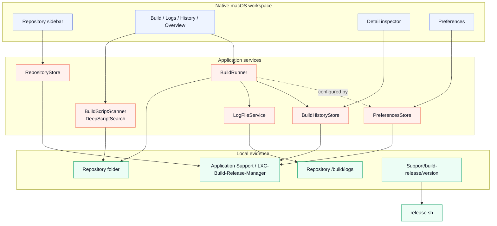
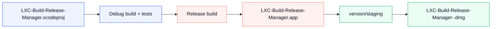

# LXC Build & Release Manager

<div align="center">
  
  <br>
  <br>
  <strong>A release room for the scripts you already trust.</strong>
  <br>
  <sub>Discover the workflow. Run it visibly. Preserve the evidence. Ship with intent.</sub>
  <br>
  <br>
  <a href="Support/worklog/BRM-Plan-todo.md"><strong>Delivery plan</strong></a>
  &nbsp;&nbsp;|&nbsp;&nbsp;
  <a href="Support/README.md">Support handbook</a>
  &nbsp;&nbsp;|&nbsp;&nbsp;
  <a href="Support/build-release/USER_GUIDE.md">User guide</a>
  &nbsp;&nbsp;|&nbsp;&nbsp;
  <a href="Support/context/architecture.md">Architecture</a>
  &nbsp;&nbsp;|&nbsp;&nbsp;
  <a href="Support/context/diagrams/README.md">Visual diagrams</a>
</div>

<br>

<div align="center">
  
  
  
  
  
  
</div>

<br>

<table align="center">
  <tr>
    <td width="33%" bgcolor="#EEF4FF"><strong>01 / DISCOVER</strong><br><sub>Turn repository structure into a clear build surface.</sub></td>
    <td width="33%" bgcolor="#FFF1EE"><strong>02 / OBSERVE</strong><br><sub>Watch every process, line, status, and outcome as it happens.</sub></td>
    <td width="33%" bgcolor="#ECFDF5"><strong>03 / RELEASE</strong><br><sub>Move from a trusted local build to a deliberate artifact.</sub></td>
  </tr>
</table>

## The premise

Every serious project has a build language of its own: a handful of shell scripts, a few release conventions, a log folder, and a lot of tribal memory. LXC Build Release Manager turns that invisible language into a native macOS workspace without replacing the scripts or hiding the process behind a black box.

Point LXC Build Release Manager at a repository. It finds the build contract, presents the available commands, runs local work in the right context, streams the output, records the result, and keeps the project knowledge close enough to guide the next release.

This is not another CI platform. It is the calm, inspectable room between a repository and the person responsible for shipping it.

## Product flow

```mermaid
flowchart LR
    A["Repository"] --> B["Discover scripts"]
    B --> C["Choose a build"]
    C --> D["Run locally"]
    D --> E["Live output"]
    E --> F["History + logs"]
    F --> G["Release artifact"]

    classDef source fill:#EEF4FF,stroke:#3155E7,color:#0B1020,stroke-width:1.5px;
    classDef action fill:#FFF1EE,stroke:#F27D68,color:#0B1020,stroke-width:1.5px;
    classDef evidence fill:#ECFDF5,stroke:#16A36A,color:#0B1020,stroke-width:1.5px;
    class A,B source;
    class C,D action;
    class E,F,G evidence;
```



In practice, that is six steps:

1. Add a repository from the sidebar — a local folder, or a GitHub URL.
2. The app checks the repository and discovers `/build/scripts`.
3. Choose a script, set its parameters, and run it locally.
4. Watch the live output, or stop it and keep the partial log.
5. Review the result in Logs, History, or Overview.
6. Use the release flow when the build is ready to become a distributable artifact.

A GitHub source can be inspected through the Contents API, but only a local checkout can execute a
script — a process needs a real working directory. That boundary is deliberate, and it is recorded
in the [Build tab plan](Support/worklog/Plan-Tab-Build-todo.md).

## What ships

<table>
  <tr>
    <td width="50%"><strong>Repository intelligence</strong><br><sub>Local folders and GitHub URLs, recent repositories, pinned projects, source state, branch display, and clear missing-folder or unreachable states.</sub></td>
    <td width="50%"><strong>Script discovery</strong><br><sub>Standard discovery under <code>/build/scripts</code>, executable-file detection, readable labels, location classification, and optional deep search for scripts elsewhere in a local tree.</sub></td>
  </tr>
  <tr>
    <td><strong>Build execution</strong><br><sub>Configured shell execution from the repository root, parameter validation, environment variables, timeouts, stop behavior, and child-process handling.</sub></td>
    <td><strong>Live console</strong><br><sub>Timestamped stdout and stderr, buffered partial lines, search, filters, line numbers, word wrapping, auto-scroll, copy, and export.</sub></td>
  </tr>
  <tr>
    <td><strong>History that explains the work</strong><br><sub>Per-repository runs, success and failure states, duration, average time, success rate, last-run metadata, and retained log files.</sub></td>
    <td><strong>A release-ready workspace</strong><br><sub>Native preferences, layout controls, right-side detail inspector, release scripts, local app staging, and a dated DMG workflow.</sub></td>
  </tr>
</table>

## Runtime architecture

The app keeps the visual shell thin and gives each responsibility a clear owner. SwiftUI composes the workspace; services own discovery, execution, persistence, and release evidence.



The detailed responsibility map lives in [Support/context/architecture.md](Support/context/architecture.md). The source-controlled SVG maps live in [Support/context/diagrams](Support/context/diagrams/README.md).

## Release pipeline

The release path is intentionally boring: verify first, package second, inspect the artifact third.



Run the local packaging flow from the repository root:

```sh
./Support/build-release/scripts/release.sh
```

The generated app and DMG are intentionally ignored by Git. The staging contract is documented in [version/README.md](Support/build-release/version/README.md). Production distribution still requires Developer ID signing and notarization.

## Quick start

### Build and test from the terminal

```sh
xcodebuild -project LXC-Build-Release-Manager.xcodeproj -scheme LXC-Build-Release-Manager -configuration Debug build
xcodebuild -project LXC-Build-Release-Manager.xcodeproj -scheme LXC-Build-Release-Manager -configuration Debug test
```

### Run from Xcode

Open `LXC-Build-Release-Manager.xcodeproj`, choose the `LXC-Build-Release-Manager` scheme and `My Mac`, then press `Cmd+R`.

### Give the app a repository

The default repository contract is intentionally small:

```text
your-repository/
  build/
    scripts/
      build-ios.sh
      release.sh
    logs/
```

Add a local folder or GitHub URL from the sidebar. GitHub sources can be inspected through the contents API; only local checkouts can execute a script because the process must have a real working directory.

## Support is part of the product

The `Support/` tree is not loose project paperwork. It is the product's memory and release operating system.

```mermaid
flowchart LR
    requirements["Requirements"] --> decisions["Decisions"]
    decisions --> tracker["BRM plan index"]
    tracker --> plan["Area plan"]
    plan --> code["App code"]
    code --> verify["Build / test / GUI evidence"]
    verify --> story["Quality &amp; verification ledger"]

    classDef context fill:#EEF4FF,stroke:#3155E7,color:#0B1020;
    classDef delivery fill:#FFF1EE,stroke:#F27D68,color:#0B1020;
    classDef evidence fill:#ECFDF5,stroke:#16A36A,color:#0B1020;
    class requirements,decisions context;
    class tracker,plan,code delivery;
    class verify,story evidence;
```



| Area | What it owns | Open it |
| --- | --- | --- |
| Build and release | Commands, packaging, project mapping, logs guidance, and artifact staging. | [Support/build-release](Support/build-release/README.md) |
| Context | Requirements, architecture, rules, decisions, and design references for humans and AI tools. | [Support/context](Support/context/README.md) |
| Frameworks | System framework inventory and future package or adapter records. | [Support/frameworks](Support/frameworks/README.md) |
| Shared | Reusable conventions and cross-feature ideas. | [Support/shared](Support/shared/README.md) |
| Worklog | The plan index, one plan per area, and the verification ledger. | [Support/worklog](Support/worklog/README.md) |
| Research | Open topics being considered, with no tasks attached and nothing promised. | [Support/research](Support/research/README.md) |

## The delivery plan

Everything being built, everything already shipped, and everything still open starts in one file:

<div align="center">
  <h3><a href="Support/worklog/BRM-Plan-todo.md">📋 BRM-Plan-todo.md — the master plan index</a></h3>
  <sub>Open it, find your area in a table, follow the link, work there.</sub>
</div>

The index carries no tasks of its own. It links every plan, mirrors each plan's current count, maps
each requirements section to the plan that owns it, and tells you where a new task belongs. Below is
the same map, so you can jump straight in from here.

### By window region

```text
┌─────────────┬──────────────────────────────┬──────────────┐
│ Left        │  Main panel                  │ Detail View  │
│ sidebar     │  (header + toolbar + tabs)   │ panel        │
├─────────────┴──────────────────────────────┴──────────────┤
│ Status bar                                                 │
└────────────────────────────────────────────────────────────┘
```

| Region | Plan | Owns |
| --- | --- | --- |
| Whole window | [Plan-AppShellUI](Support/worklog/Plan-AppShellUI-todo.md) | Background, material and glass language, theme and accent |
| Left sidebar | [Plan-LeftSidebar](Support/worklog/Plan-LeftSidebar-todo.md) | Repositories, recents, add/remove, the footer buttons |
| Main panel | [Plan-MainPanel](Support/worklog/Plan-MainPanel-todo.md) | Index over the three bands and six tabs below |
| Detail View panel | [Plan-DetailViewPanel](Support/worklog/Plan-DetailViewPanel-todo.md) | The right inspector: script, parameters, status, history, actions |
| Status bar | [Plan-StatusBar](Support/worklog/Plan-StatusBar-todo.md) | Repository, branch, platform and auto-detect chips |

### Inside the main panel

| Band | Plan | Owns |
| --- | --- | --- |
| Header | [Plan-MainPanel-Header](Support/worklog/Plan-MainPanel-Header-todo.md) | Repository name, badge, path lines, Reveal / Terminal / Copy |
| Toolbar | [Plan-MainPanel-Toolbar](Support/worklog/Plan-MainPanel-Toolbar-todo.md) | The six-tab picker and the rule beneath it |
| Container | [Plan-MainPanel-Container](Support/worklog/Plan-MainPanel-Container-todo.md) | The work-area surface, padding, scrolling, card treatment |

| Tab | Plan | Owns |
| --- | --- | --- |
| Build | [Plan-Tab-Build](Support/worklog/Plan-Tab-Build-todo.md) | Script discovery, parameters, execution, live output |
| Logs | [Plan-Tab-Logs](Support/worklog/Plan-Tab-Logs-todo.md) | Saved logs, filters, search, export |
| History | [Plan-Tab-History](Support/worklog/Plan-Tab-History-todo.md) | Every recorded run for the repository |
| Overview | [Plan-Tab-Overview](Support/worklog/Plan-Tab-Overview-todo.md) | Repository summary and build statistics |
| Docs | [Plan-MarkdownExplorer](Support/worklog/Plan-MarkdownExplorer-todo.md) | Markdown discovery, rendering, Preview/Source editing |
| Settings | [Plan-Tab-Settings](Support/worklog/Plan-Tab-Settings-todo.md) | Per-repository settings, distinct from the Preferences window |

### Features, engineering, and release

| Area | Plan | Owns |
| --- | --- | --- |
| Preferences window | [Plan-PreferenceScreen](Support/worklog/Plan-PreferenceScreen-todo.md) | Seven tabs, every field, and the wiring audit behind them |
| Update checking | [Plan-Updates](Support/worklog/Plan-Updates-todo.md) | GitHub Releases feed, version comparison, stable and beta |
| Localization | [Plan-Localization](Support/worklog/Plan-Localization-todo.md) | English and Hindi, the string catalogue, language switching |
| Window layout | [Plan-WindowLayout](Support/worklog/Plan-WindowLayout-todo.md) | Resizing, the View menu, panel visibility and persistence |
| Code refactoring | [Plan-CodeRefactoring-Reusability](Support/worklog/Plan-CodeRefactoring-Reusability-todo.md) | Feature extraction, dependency seams, reuse |
| Xcode project | [Plan-XcodeProject](Support/worklog/Plan-XcodeProject-todo.md) | Target membership, build settings, schemes, project hygiene |
| Quality & verification | [Plan-QualityVerification](Support/worklog/Plan-QualityVerification-todo.md) | Non-functional targets, tests, GUI coverage, standing caveats |
| Release & packaging | [Plan-ReleasePackaging](Support/worklog/Plan-ReleasePackaging-todo.md) | Release script, staging, the `.dmg`, tags, signing |
| Context & diagrams | [Plan-ContextArchitectureVisuals](Support/worklog/Plan-ContextArchitectureVisuals-todo.md) | The SVG diagram set and its documentation wiring |

The rules that keep this coherent — one plan per area, `[x]` only when verified, no dated tracker
files — are in [the worklog README](Support/worklog/README.md) and
[decision-2026-08-18](Support/context/decisions/decision-2026-08-18.md).

## Current release signal

<table>
  <tr>
    <td bgcolor="#EEF4FF"><strong>0.1.2</strong><br><sub>current product line</sub></td>
    <td bgcolor="#EEF4FF"><strong>Native macOS</strong><br><sub>Swift 6, SwiftUI, AppKit, Foundation</sub></td>
    <td bgcolor="#FFF1EE"><strong>Tagged build</strong><br><sub><code>release-2026-08-16</code></sub></td>
    <td bgcolor="#ECFDF5"><strong>Verification</strong><br><sub>Debug build + 80 tests, 0 failures</sub></td>
  </tr>
</table>

The remaining hardening work is kept honest in [Plan-QualityVerification](Support/worklog/Plan-QualityVerification-todo.md) — measured performance numbers, resilience coverage, which parts of the app have actually been click-tested, and the caveats that are true of the product rather than bugs waiting to be fixed.

## Data locations

| Data | Location |
| --- | --- |
| Recent repositories | `~/Library/Application Support/LXC-Build-Release-Manager/projects.json` |
| Build history | `~/Library/Application Support/LXC-Build-Release-Manager/build-history.json` |
| Build workspace state | `~/Library/Application Support/LXC-Build-Release-Manager/build-workspace-state.json` |
| Preferences | `~/Library/Application Support/LXC-Build-Release-Manager/preferences.json` |
| Runtime logs | `<repository>/build/logs/` |
| Release staging | `Support/build-release/version/` |

## Documentation navigation

| If you want to... | Read... |
| --- | --- |
| **See the whole plan and pick up work** | **[BRM plan index](Support/worklog/BRM-Plan-todo.md)** |
| Operate the app | [User Guide](Support/build-release/USER_GUIDE.md) |
| Package a release | [Build and Release](Support/build-release/README.md) |
| Give an AI tool project context | [Support Handbook](Support/README.md) and [Context README](Support/context/README.md) |
| Understand the architecture | [Architecture](Support/context/architecture.md) |
| See the system visually | [Context diagrams](Support/context/diagrams/README.md) |
| Follow what is actually complete | [Quality & verification](Support/worklog/Plan-QualityVerification-todo.md) |
| See the Build workspace record | [Build tab plan](Support/worklog/Plan-Tab-Build-todo.md) |
| Package or publish a release | [Release & packaging](Support/worklog/Plan-ReleasePackaging-todo.md) |
| Read what is being considered, not built | [Research](Support/research/README.md) |
| Browse visual references | [Concepts and Designs](Support/context/concepts-designs/README.md) |

## Contributing

Start with [CONTRIBUTING.md](CONTRIBUTING.md), read the [Support Handbook](Support/README.md), and keep code, context, and worklog status synchronized in the same change. Generated `.app`, `.dmg`, logs, and local build data stay out of commits.

## License

LXC Build Release Manager is released under the [MIT License](LICENSE).
