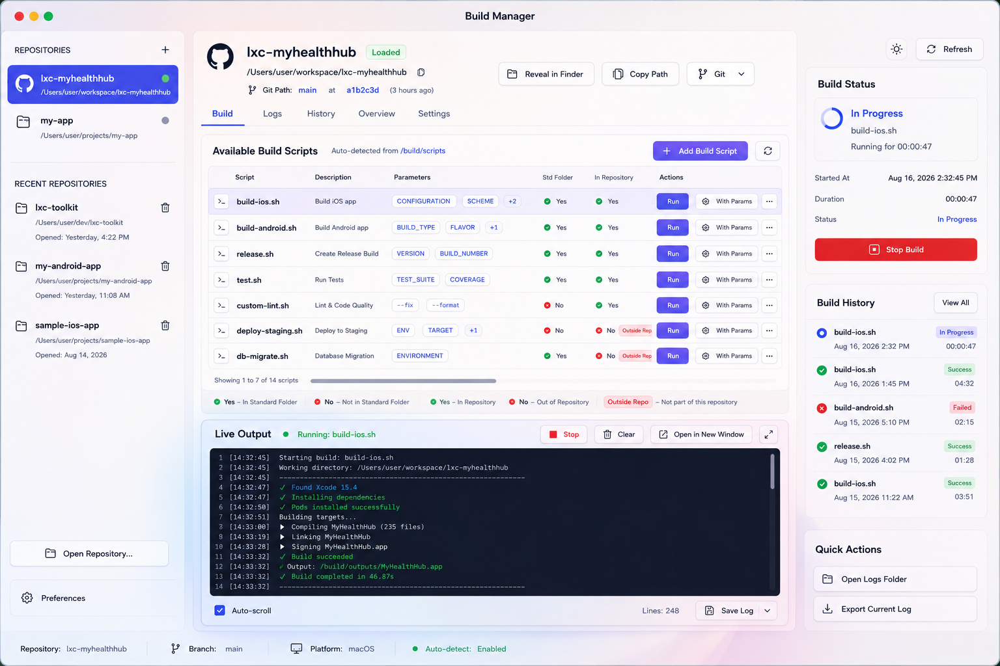

# LXC Build Release Manager Support Handbook

<p align="center">
  <strong>The project map behind the Build Manager.</strong><br>
  Build and release operations, AI-readable context, framework notes, shared ideas, and execution history live here.
</p>

<p align="center">
  
  
  
  
</p>

> This folder is the operating system for the project itself. The app executes the build work; Support explains the contract, records the decisions, maps the release, and gives humans and AI tools enough context to work safely.

## The project story

LXC Build Release Manager is a native macOS build and release manager for repositories that expose their build workflow as scripts. The product is organized around one simple loop:

1. Discover what a repository can build.
2. Run a local build with visible, timestamped output.
3. Preserve the result as a log, history record, and release signal.
4. Keep the knowledge needed for the next change close to the code.

The Support tree makes that loop understandable and repeatable. It is intentionally separated into six roles:

| Role | What it answers | Folder |
| --- | --- | --- |
| Build and release | How do we build, package, stage, and describe an artifact? | [`build-release/`](build-release/README.md) |
| Context | What are we building, why, which decisions are authoritative, and how do the system boundaries connect? | [`context/`](context/README.md) |
| Frameworks | Which system frameworks, adapters, and package ideas are available? | [`frameworks/`](frameworks/README.md) |
| Shared | Which conventions and reusable support ideas should stay consistent? | [`shared/`](shared/README.md) |
| Worklog | What is planned, what shipped, and what still needs verification? | [`worklog/`](worklog/README.md) |
| Research | What are we considering, and what would have to be true for it to work? | [`research/`](research/README.md) |

## Current release snapshot

| Signal | Current value |
| --- | --- |
| Product | LXC Build Release Manager |
| Release line | `0.1.2` |
| Tagged local release | `release-2026-08-16` |
| Platform | macOS 15 or later |
| Implementation | Swift 6, SwiftUI, AppKit, Foundation, XCTest |
| Third-party packages | None; the app uses system frameworks only |
| Release artifact | `build-release/version/LXC-Build-Release-Manager-<version>.dmg` locally |
| Verification command | `xcodebuild -project LXC-Build-Release-Manager.xcodeproj -scheme LXC-Build-Release-Manager -configuration Debug test` |

The tracked release contract is kept beside the generated output in [`build-release/version/README.md`](build-release/version/README.md). Generated `.app` and `.dmg` files are ignored by Git so local artifacts do not become source files.

## What the app brings

### Build workspace

The Build workspace is the product's center of gravity. It discovers shell scripts from a repository's `/build/scripts` folder, shows script and location state, runs local scripts, streams stdout and stderr, and exposes stop, refresh, log export, history, and quick actions. The reference concept is kept here:



The current Build workspace record is [`worklog/Plan-Tab-Build-todo.md`](worklog/Plan-Tab-Build-todo.md). It is an execution record, not a marketing promise: completed items are marked only when the matching behavior exists in the codebase.

### Release support

The release surface connects the native Xcode project to a repeatable local artifact flow:

```text
Xcode project -> Debug or Release build -> staged .app -> local .dmg -> version/
```

The script [`build-release/scripts/release.sh`](build-release/scripts/release.sh) builds with signing disabled for local staging, copies the app into `version/staging/`, and creates a dated DMG in `version/`. Distribution signing and notarization remain separate release concerns and are not implied by the local artifact.

### Context for people and AI tools

The Context area is the reasoning layer. It keeps the requirements input, the current architecture, operating rules, dated decisions, and visual references in one place so an AI tool can learn the project before proposing or changing code.

The important rule is precedence: recorded decisions describe the implementation path when they differ from the original requirements input. The mismatch stays visible; it is not silently erased.

### Frameworks and shared ideas

The Frameworks area is a curated inventory and extension boundary, not a hidden package dump. The current app has no third-party dependency package to update. When a framework, SDK, adapter, or package is introduced, its version, source, compatibility, consumer, and update date belong in [`frameworks/README.md`](frameworks/README.md).

The Shared area is where portable conventions, reusable snippets, and cross-feature ideas can be recorded before they become app-specific code. It is a place for sharing and alignment, not a second source of truth for feature progress.

### Worklog and workload mapping

The Worklog area is the delivery ledger, and it has one front door: **[`worklog/BRM-Plan-todo.md`](worklog/BRM-Plan-todo.md)**, the master plan index. It links every plan in linked tables — by window region, by tab, by feature, by engineering area — carries each plan's current count, and tells you where a new task belongs. It holds no tasks itself.

Beneath it, one plan owns one area, named `Plan-<Area>-todo.md`. Each opens with a boundary statement so a change has exactly one home, and each records what shipped alongside what is still open.

The mapping is deliberate:

```text
requirements -> decisions -> BRM-Plan-todo.md (index) -> Plan-<Area>-todo.md -> code -> verification
```

Verification evidence that spans plans — measurements, test runs, what has actually been clicked in the running app — is collected in [`worklog/Plan-QualityVerification-todo.md`](worklog/Plan-QualityVerification-todo.md).

There are no dated `todo-YYYY-MM-DD.md` or `worklog-YYYY-MM-DD.md` files. That convention was retired on 2026-08-18 and their content moved into the owning plans; see [`context/decisions/decision-2026-08-18.md`](context/decisions/decision-2026-08-18.md), and the **Retired files** table in the index for exactly where each part went.

Start with [`worklog/README.md`](worklog/README.md) for the rules, then go to the [master plan index](worklog/BRM-Plan-todo.md) to find the plan you need.

## Documentation map

### Build and release

| File | Purpose |
| --- | --- |
| [`build-release/README.md`](build-release/README.md) | Canonical Debug, Release, and DMG commands. |
| [`build-release/USER_GUIDE.md`](build-release/USER_GUIDE.md) | Human-facing repository, build, logs, history, and preferences guide. |
| [`build-release/projects.json`](build-release/projects.json) | Example project/script mapping used as a configuration template. |
| [`build-release/scripts/`](build-release/scripts/) | Build and packaging entry points. |
| [`build-release/logs/README.md`](build-release/logs/README.md) | Explains support logs versus per-repository application logs. |
| [`build-release/version/README.md`](build-release/version/README.md) | Release artifact staging contract. |

### Context

| File | Purpose |
| --- | --- |
| [`context/README.md`](context/README.md) | How to read the context set and use it for AI-assisted work. |
| [`context/requirements.md`](context/requirements.md) | Functional requirements input retained in the repository. |
| [`context/architecture.md`](context/architecture.md) | Current UI, workspace, documentation, and decision architecture. |
| [`context/rules-context.md`](context/rules-context.md) | Rules that keep the workspace coherent. |
| [`context/decisions/`](context/decisions/) | Dated records of choices that override or clarify the input. |
| [`context/concepts-designs/`](context/concepts-designs/) | Screens, mockups, and the source requirements PDF. |
| [`context/diagrams/`](context/diagrams/) | Self-contained SVG maps for system context, runtime architecture, and release flow. |

### Frameworks, shared, and worklog

| Area | Entry point | Contents |
| --- | --- | --- |
| Frameworks | [`frameworks/README.md`](frameworks/README.md) | System framework matrix and future package/adapter notes. |
| Shared | [`shared/README.md`](shared/README.md) | Reusable conventions and cross-feature ideas. |
| Worklog | [`worklog/README.md`](worklog/README.md) | Tracking rules and file ownership. |
| Research | [`research/README.md`](research/README.md) | The reading file: every open topic, its question, and its stage. |

### Delivery plans

Every plan is reachable from the index; these are the ones a newcomer usually wants first.

| Plan | Owns |
| --- | --- |
| **[`worklog/BRM-Plan-todo.md`](worklog/BRM-Plan-todo.md)** | **The master index — start here.** Links every plan, mirrors its count, maps requirements to owners. |
| [`worklog/Plan-LeftSidebar-todo.md`](worklog/Plan-LeftSidebar-todo.md) | Repositories, recents, adding and removing, the footer buttons. |
| [`worklog/Plan-MainPanel-todo.md`](worklog/Plan-MainPanel-todo.md) | The centre column — an index over its header, toolbar, container and six tabs. |
| [`worklog/Plan-Tab-Build-todo.md`](worklog/Plan-Tab-Build-todo.md) | Script discovery, parameters, execution, and the live output terminal. |
| [`worklog/Plan-DetailViewPanel-todo.md`](worklog/Plan-DetailViewPanel-todo.md) | The right inspector column. |
| [`worklog/Plan-StatusBar-todo.md`](worklog/Plan-StatusBar-todo.md) | The bottom strip. |
| [`worklog/Plan-PreferenceScreen-todo.md`](worklog/Plan-PreferenceScreen-todo.md) | The seven-tab Preferences window and the field-by-field wiring audit. |
| [`worklog/Plan-WindowLayout-todo.md`](worklog/Plan-WindowLayout-todo.md) | Resizing, the View menu, and panel visibility. |
| [`worklog/Plan-CodeRefactoring-Reusability-todo.md`](worklog/Plan-CodeRefactoring-Reusability-todo.md) | Code structure, dependency seams, feature extraction, and reuse. |
| [`worklog/Plan-QualityVerification-todo.md`](worklog/Plan-QualityVerification-todo.md) | Non-functional targets, test-suite state, GUI coverage, standing caveats, evidence ledger. |
| [`worklog/Plan-ReleasePackaging-todo.md`](worklog/Plan-ReleasePackaging-todo.md) | The release script, staging, the `.dmg`, tags, signing and distribution. |
| [`worklog/Plan-ContextArchitectureVisuals-todo.md`](worklog/Plan-ContextArchitectureVisuals-todo.md) | The SVG diagram set and the documentation wiring around it. |

## How to use this folder

### Before changing code

1. Read this handbook.
2. Read [`context/rules-context.md`](context/rules-context.md) and [`context/architecture.md`](context/architecture.md).
3. Read the relevant requirement and decision records.
4. Open [`worklog/BRM-Plan-todo.md`](worklog/BRM-Plan-todo.md), use its **Where a new task goes** table to find the owning plan, and add the task there before implementation.

### When finishing a task

1. Update the owning plan only after the behavior exists.
2. Mark a checklist item `[x]` only when it is implemented and verified at the level the item claims.
3. Record what shipped in that plan, and update its tracking table plus the count in the index.
4. Add a row to the ledger in [`worklog/Plan-QualityVerification-todo.md`](worklog/Plan-QualityVerification-todo.md) when the verification level changed.
5. Update context when the architecture, rules, release path, or product decision changes.

### When preparing a release

1. Confirm the affected plans reflect the actual code.
2. Run the Debug build and tests.
3. Run [`release.sh`](build-release/scripts/release.sh) for the local Release app and DMG, following [`worklog/Plan-ReleasePackaging-todo.md`](worklog/Plan-ReleasePackaging-todo.md).
4. Inspect the generated artifact under `build-release/version/`.
5. Record the result in the verification ledger and tag the tree when the release is intentionally captured.

## Honest boundaries

- A GitHub URL can be scanned, but it cannot execute a build until it is available as a local checkout.
- The local release script produces an unsigned artifact for inspection and staging; production signing and notarization are separate.
- The plans remain authoritative for open work; performance, stress, settings verification and GUI hardening are tracked in [`worklog/Plan-QualityVerification-todo.md`](worklog/Plan-QualityVerification-todo.md).
- The original requirements include a Tauri/Rust/React proposal, but the recorded decision is native Swift/SwiftUI/AppKit. The decision log explains why.
- Empty framework and shared folders are intentional extension points until a real reusable asset belongs there.

## Related entry points

- [Repository landing page](../../README.md)
- [App product README](../README.md)
- [Build and release](build-release/README.md)
- [User guide](build-release/USER_GUIDE.md)
- [Context](context/README.md)
- [Context diagrams](context/diagrams/README.md)
- [Worklog](worklog/README.md)
- [Master plan index](worklog/BRM-Plan-todo.md)
- [Research](research/README.md)
