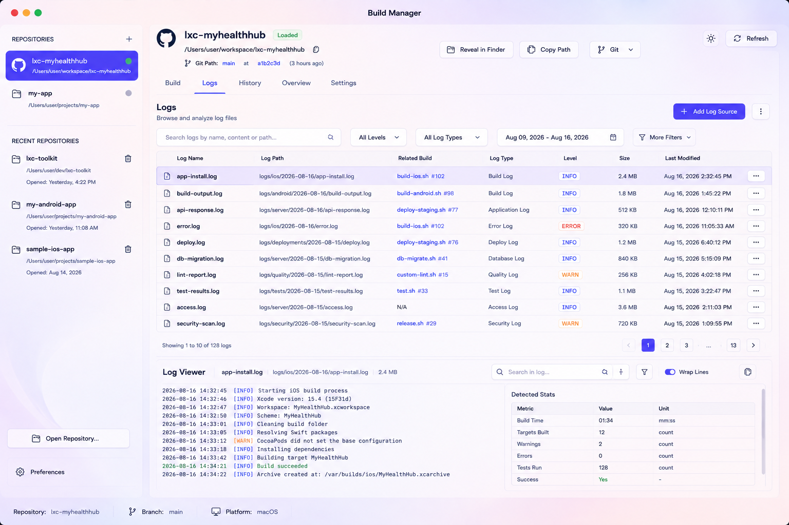

# Lexvora Consulting Package

This repository ships as a branded macOS package for Lexvora Consulting.

  

## Brand

- Website: [lexvoraconsulting.com](https://www.lexvoraconsulting.com/)
- Primary logo: [`brand-mark.svg`](../context/concepts-designs/brand-mark.svg)
- App icon artwork: [`appicon2.png`](../context/concepts-designs/AppIcons/appicon2.png)
- Supporting logo mark: [`AppIcon-BRM.png`](../context/concepts-designs/AppIcons/AppIcon-BRM.png)
- Brand banner: [`36e3fb6e-83bf-428d-95d6-80fbb63f101b.png`](../context/concepts-designs/36e3fb6e-83bf-428d-95d6-80fbb63f101b.png)

## Package intent

The release artifact is a standard macOS `.dmg` that:

- contains the signed or unsigned app bundle staged for installation
- includes the `Applications` shortcut for drag-and-drop install
- uses the project background art as the visual backdrop
- keeps the app identity aligned with Lexvora Consulting branding

## Where to look

- Build and release flow: [`README.md`](README.md)
- Human guide: [`USER_GUIDE.md`](USER_GUIDE.md)
- Local artifact staging: [`version/README.md`](version/README.md)
- Delivery plan: [`Plan-ReleasePackaging-todo.md`](../worklog/Plan-ReleasePackaging-todo.md)
- Package staging notes: [`version/PACKAGE-README.md`](version/PACKAGE-README.md)

## Notes for packaging

1. Keep the DMG install experience simple and familiar for macOS users.
2. Keep the icon consistent across Dock, Finder, and the installer.
3. Keep the website URL visible in the package notes and release docs.
4. Keep the banner artwork visible at the top of the package note so it reads like a real branded deliverable.
