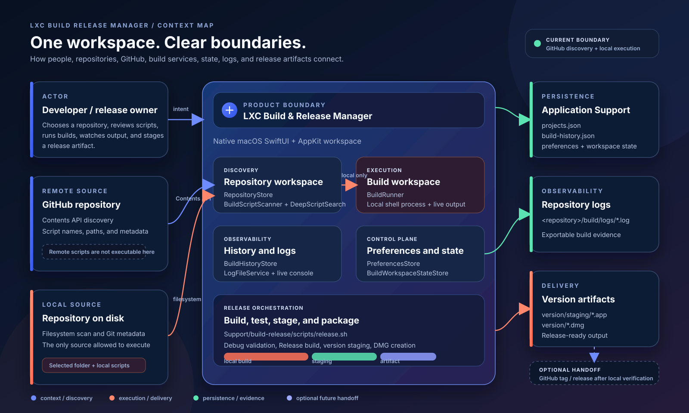
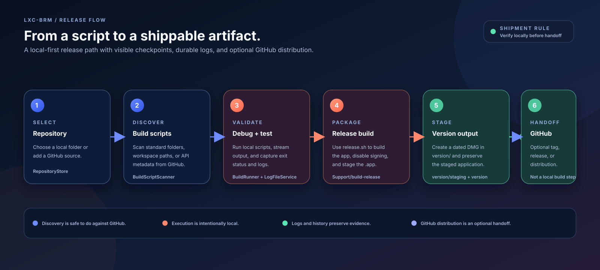

# Context Diagrams

> The visual index for the LXC Build & Release Manager architecture. These diagrams are intentionally source-controlled, self-contained SVGs so they render crisply in GitHub, editors, and local previews.

## Read In This Order

| Order | Diagram | What it answers |
| --- | --- | --- |
| 01 | [`system-context.svg`](system-context.svg) | Who and what connects to the product? |
| 02 | [`runtime-architecture.svg`](runtime-architecture.svg) | Which application layers and services carry the work? |
| 03 | [`release-flow.svg`](release-flow.svg) | How does a discovered script become a local release artifact? |

## System Context

The system map establishes the most important product boundary: GitHub can provide repository and script metadata through discovery, while a local checkout is required before a script can execute. The app persists workspace state and build history under Application Support, writes build logs beside the repository, and stages local release artifacts under `version/`.

## Runtime Architecture

The runtime map follows the path from SwiftUI/AppKit presentation surfaces into focused services and then into storage or filesystem boundaries. The service names are implementation-oriented on purpose; use the code under ``App/Services/`` as the final authority when behavior changes.

## Release Flow

The release map describes the local-first path implemented by [`../build-release/scripts/release.sh`](../../build-release/scripts/release.sh): select a repository, discover scripts, validate locally, build a Release app, stage it, create a dated DMG, and only then consider an optional GitHub tag or release handoff.

## Visual Grammar

| Signal | Meaning |
| --- | --- |
| Electric blue | Context, discovery, navigation, and metadata flow. |
| Coral | Local execution, packaging, and delivery actions. |
| Mint | Persistence, logs, history, and durable evidence. |
| Lavender dashed flow | Optional future or external handoff, not a verified local runtime step. |
| Dark navy card | A boundary, service, or storage responsibility. |

## Accuracy Contract

- The diagrams describe the current native macOS implementation: Swift 6, SwiftUI, AppKit, Foundation, and XCTest.
- GitHub is represented as a Contents API discovery source. Remote script metadata is not shown as executable.
- Local repository execution is represented through `BuildRunner` and the configured shell process.
- Persistence paths follow [`../architecture.md`](../architecture.md) and the service implementations.
- Release packaging follows [`../../build-release/scripts/release.sh`](../../build-release/scripts/release.sh).
- If code and diagram disagree, code wins and the diagrams must be updated in the same documentation pass.

## Maintenance

Update this folder when a service responsibility, storage path, release boundary, or external integration changes. Keep the SVGs self-contained: no remote fonts, scripts, or runtime dependencies should be required to view them.

Return to the [Context README](../README.md) or the [Support Handbook](../../README.md).
