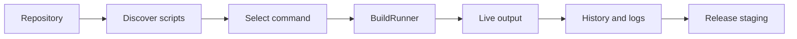

# Product Architecture — LXC Build & Release Manager

> **Source evidence:** `README.md`, `App/`, `Tests/`, `Support/context/architecture.md`, and repository diagrams.

## Purpose

The application is a native macOS release workspace. It keeps the visual shell
thin and assigns repository discovery, process execution, persistence, logging,
and release staging to focused services.

## Main Components

| S.No. | Component | Responsibility |
| ---: | --- | --- |
| 1 | SwiftUI/AppKit workspace | Composes sidebar, build, logs, history, overview, and preferences surfaces |
| 2 | `RepositoryStore` | Tracks repositories, source identity, branch state, and local metadata |
| 3 | `BuildScriptScanner` / `DeepScriptSearch` | Finds standard and optional build scripts |
| 4 | `BuildRunner` | Executes a selected script from the repository root and manages process lifecycle |
| 5 | `BuildHistoryStore` | Persists run outcome, duration, status, and last-run information |
| 6 | `LogFileService` | Writes and retrieves retained execution evidence |
| 7 | Preferences/data stores | Preserve user configuration and workspace state |

## Runtime Flow

## Boundary Rules

- A GitHub source may be inspected through repository contents.
- Script execution requires a local checkout and a real working directory.
- Repository logs remain close to the project under its build/logs contract.
- Application state is stored separately in macOS Application Support.
- No third-party package dependency is part of the declared runtime design.

## Verification Evidence

`Tests/` contains build-screen, workspace, Markdown, and resilience test suites.
The repository also provides scripts for debug builds, test execution, release
staging, release publishing, and app-icon generation.

## Navigation

Parent: [`documentation-master.md`](./documentation-master.md) · Analysis:
[`project-analysis.md`](./project-analysis.md) · Context:
[`../context/architecture.md`](../context/architecture.md)
